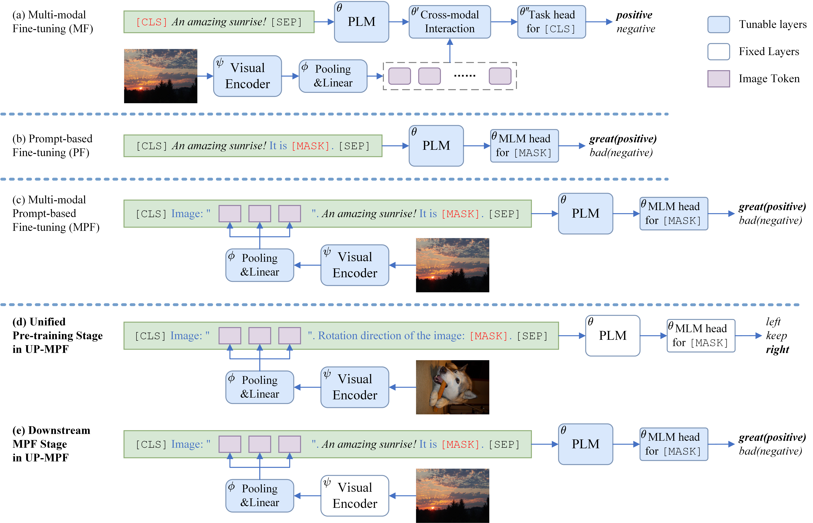

# UP-MPF (Unified Pre-training for Multi-modal Prompt-based Fine-tuning)

This is the implementation of our ACM MM '22 paper "[Unified Multi-modal Pre-training for Few-shot Sentiment Analysis with Prompt-based Learning](https://doi.org/10.1145/3503161.3548306)".

## Overview



The figure shows the architectures of previous approaches (a,b) and our MPF/UP-MPF approaches (c,d,e) for coarse-grained MSA. *Italic text* is the real textual input while the others are prompt tokens in templates.

## Requirements

- matplotlib 3.3.4
- numpy 1.20.2
- opencv-python 4.5.4.58
- pillow 8.2.0
- python 3.8
- pytorch 1.7.1
- scikit-learn 0.24.2 
- timm 0.4.12
- tqdm 4.59.0
- transformers 4.6.0

we mainly use `conda` commands to set up our environment but use `pip` to install `opencv-python`, `timm` and `transformers`.

## Prepare the data

You can download the datasets from the original links below and preprocess the data following the scrips in `datasets_pre_processing`, or you can download images from our [BaiduNetdisk](https://pan.baidu.com/s/12HeY_b5fHwELubblboTTdg?pwd=hi4n) and use preprocessed data in `datasets` directly.

>**Original links**
>
>COCO2014: [`train2014.zip`](http://images.cocodataset.org/zips/train2014.zip) and [`val2014.zip`](http://images.cocodataset.org/zips/val2014.zip) from https://cocodataset.org
>
>Twitter-15 and Twitter-17: [`IJCAI2019_data.zip`](https://drive.google.com/file/d/1PpvvncnQkgDNeBMKVgG2zFYuRhbL873g/view) from https://github.com/jefferyYu/TomBERT
>
>MASAD: [`MASAD.zip`](https://drive.google.com/file/d/19YJ8vEYCb-uEKUqSGFmysUTvNzxhVKFE/view?usp=sharing) from https://github.com/12190143/MASAD
>
>MVSA-S and MVSA-M: [`MVSA-Single.zip`](https://portland-my.sharepoint.com/:u:/g/personal/shiaizhu2-c_my_cityu_edu_hk/Ebcsf1kUpL9Do_u4UfNh7CgBC19i6ldyYbDZwr6lVbkGQQ) and [`MVSA-multiple.zip`](https://portland-my.sharepoint.com/:u:/g/personal/shiaizhu2-c_my_cityu_edu_hk/EV4aaLrE-nxGs4ZNyZ8J_o8Bj6hui-PnU-FKYtG7S5r_xQ) from http://mcrlab.net/research/mvsa-sentiment-analysis-on-multi-view-social-data
>
>TumEmo: [`all_data_id_and_label.txt`](https://pan.baidu.com/s/1O8GmVGCDp_XRftSdEBLghQ) (access code `9hh1`) and [`all_data.zip`](https://pan.baidu.com/s/1F5d1urf67-yaSy-tcsS_4A) (access code `88il`) from https://github.com/YangXiaocui1215/MVAN

The UP models we used can be found [here](https://pan.baidu.com/s/1Pwq0_MPcM7GSsiaCXBFlgg?pwd=hvli).

## Run UP-MPF

### Quick start

```shell
python main.py \
    --cuda 0 \
    --out_dir 'out' \
    --img_dir 'MVSA-S_data' \
    --dataset 'mvsa-s' \
    --train_file 'train_few1.tsv' \
    --dev_file 'dev_few1.tsv' \
    --template 1 \
    --prompt_shape '111' \
    --pooling_scale '11' \
    --batch_size 32 \
    --lr_lm_model 1e-5 \
    --lr_resnet 0 \
    --lr_visual_mlp 1e-5 \
    --early_stop 40 \
    --seed 5 \
    --load_visual_encoder \
    --up_model_path 'rot_pretrain_49-1-94.36.bin'
```

The prediction result will be saved in a `.txt` file in path `out/mvsa-s+/[s1][d1][t1][ps111][nf_resnet50][lp11]`. 

`mvsa-s+` indicates we load UP models here. When running on a specific MSA dataset `<dataset>`, all the PF and MPF results will be saved in `<out_dir>/<dataset>` and UP-MPF results will be saved in `<out_dir>/<dataset>+`.

`[s1]`, `[d1]` and `[t1]` stand for "train_few1.tsv" (the few-shot training file), "dev_few1.tsv" (the few-shot development file) and template 1 respectively. 

`[ps111]` represents `--prompt_shape` is set to "111" here. This parameter shows the number of learnable tokens in each `[LRN]`. For example, there are 3 `[LRN]`s in the multi-modal template 1 for MVSA-S. We set `--prompt_shape` to "111" and each `[LRN]` will contain one learnable token when running. It only works and appears in the save path when we use learnable templates (template 1).

`[nf_resnet50]` suggests that we use NF-ResNet50 as the visual encoder (default setting) and `[lp11]` means we set the local pooling scale to 1×1 here.

As mentioned in the paper, we found that freezing the parameters of the visual encoder seems to bring better performance in UP-MPF (similar phenomenon was found in MPF too). Thus, we set `--lr_resnet` to 0 when conducting MPF and UP-MPF experiments. Of course you can try other values to acquire better performance.

### Experiments with multiple runs

We provide `run/pre-train.sh` to perform our Unified Pre-training (UP) and carry out downstream MSA experiments with `run/pf.sh`, `run/mpf.sh` and `run/up-mpf.sh`.

After running a script for MSA task, you will get all the required results under the corresponding configuration (e.g., `[s1][d1][t1]` on MVSA-S). 

We report the average performance in the paper. `get_results.py` can help you obtain the maximum values, mean values and standard deviations under each configuration. And then you can run `gather_best_mm_results.py` to collect all the MPF results and best UP-MPF results in `best_mm_results.txt`.

```shell
bash run/pf.sh
bash run/mpf.sh
bash run/up-mpf.sh

python get_results.py
python gather_best_mm_results.py
```

You can also perform your own Unified Pre-training (UP) or try other MSA datasets with other `train_file`, `dev_file` and `template` by modifying the running scripts.
